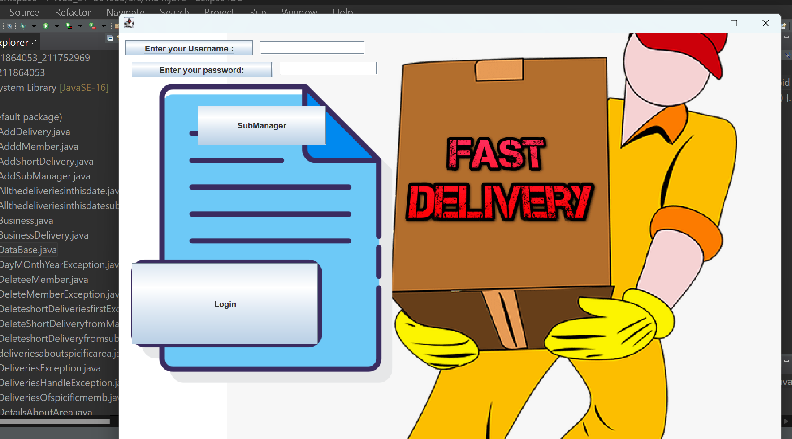
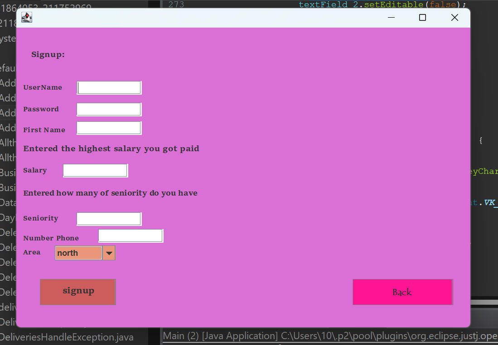
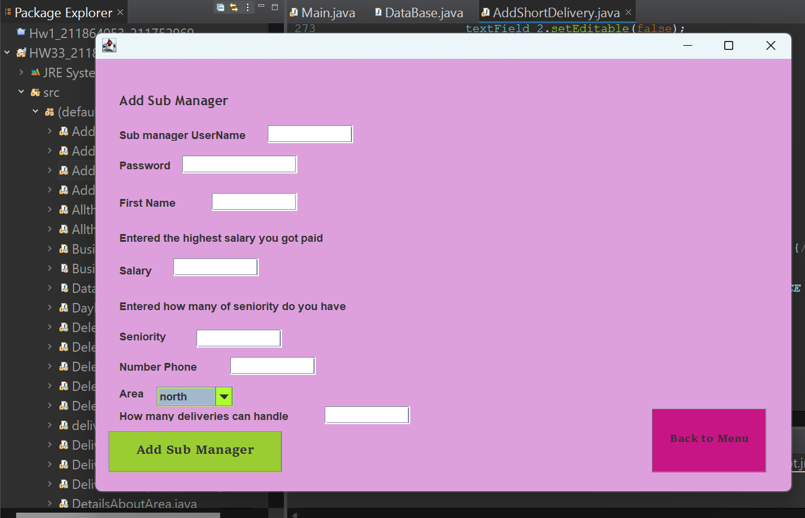
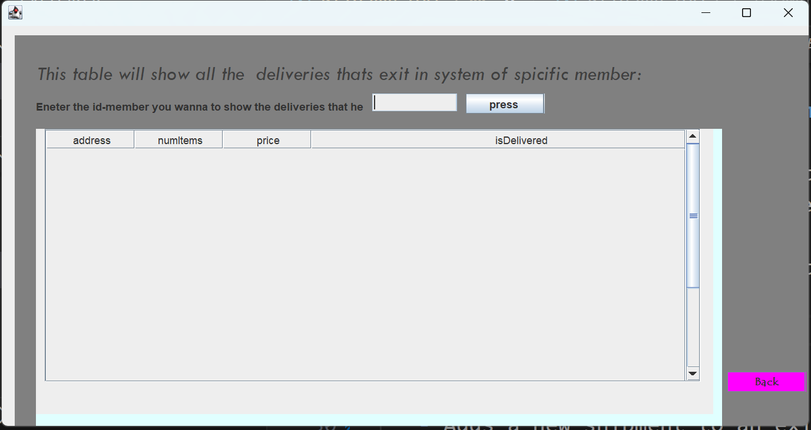

# Direct_to_Your_Door

Direct to Your Door is a Java-implemented prototype created for the 'Shipping for You' company, designed to efficiently supervise and manage various types of deliveries.
The system caters to a spectrum of delivery categories, encompassing standard, express, and business delivery modes.In addition , The system comprises members, each with their details, residential area (north, center, or south), and an array of deliveries of various types.

The main system consists of an array of managers, each responsible for subscribers in a specific region (north, center, or south). The system administrator has a username and password stored in variables within the administrator class.
After logging in, the system will show a menu.

### Main Managers Menu

1. **Managers:**

- Enables the addition of a manager to the system.
- Enables the addition of a vice manager to the system.

2.  **Subscription:**

- Allows the addition of subscription details to the manager's system.
- Provides functionality to delete a subscription using a subscription code.

3. **Retrieve Deliveries by Customer Code:**

   - Retrieves all encompassing standard, express, and business deliveries of a customer using their code in a JTable.

4. **Add New Shipment:**

   - Adds a new shipment to an existing customer's array in the array of the same manager.

5. **Delete Short Shipment:**

-It includes a brief shipment deletion form that utilizes a member code to remove the corresponding delivery from the system.

6. **Show Details About Last Shipment**

-Entering a member code (the unique code) - the system will display on the screen his last order and the details of the deliveries
which he ordered.

7. **Display specific area's delivery details**

-It shows us all the delivery details about a specific area within a TextArea.

8. **Display All**
   -Displaying all the members and deliveries within a TextArea .

9. **Specific Date About The Deliveries**
   -By entering the date you want it will show you all the deliveries that are exiting this specific date within a JTable.

10. **Finish**
    -finish and exit the system, the system will print an appropriate message.

### Guidelines

1. I made sure to give meaningful names.
2. I made sure to use the toString/getters/setters methods and not to use public type variables.
3. Pay attention when using the principle of inheritance and polymorphism and interfaces.
4. Pay attention to the connections between the departments. For example, a connection between a delivery and a subscriber, or a connection between an administrator and a subscriber, etc.

  

