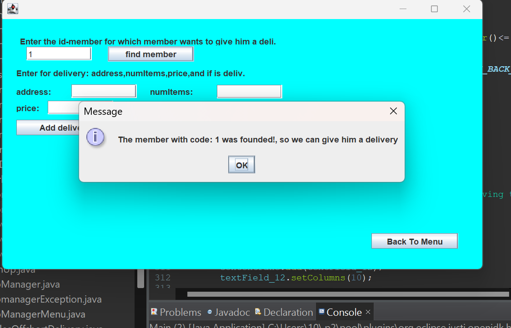

# Direct_to_Your_Door

Direct to Your Door is a Java-implemented prototype created for the 'Shipping for You' company, designed to efficiently supervise and manage various types of deliveries.
The system caters to a spectrum of delivery categories, encompassing standard, express, and business delivery modes.In addition , the system comprises members, each with their details, residential area (north, center, or south), and an array of deliveries of various types.

The main system consists of an array of managers, each responsible for subscribers in a specific region (north, center, or south). The system administrator has a username and password stored in variables within the administrator class.
After logging in, the system will show a menu.

## Database

I decided to make a kind of "DataBase" for the system, for this purpose I built a class called DataBase.
 
The Database class is a service class that contains static values and will contain:

1. Integer countTree
2. ArrayList of the system administrators
3. TreeMap of recent shipments ordered by subscribers.

- Map<Member,Delivery> ourLastDeliveries=new TreeMap<Member,Delivery>();
  The key will be the name of the subscriber, and the value is the delivery.
  ## A short explanation:
  In TreeMap there is a sorting from the smallest to the largest, if you enter numbers (Integer) for example, it will know how to sort, but if it is instances of a class, you must make sure to sort the class according to the value that you determine.
  ## Pay attention:
  That every time a subscriber orders a delivery it goes into ourLastDeliveries so that it overwrites the last delivery that was made. This is according to the principles of TreeMap.

4. Two additional TreeMaps that always work simultaneously, one that contains the current value of countTree together with a customer name and the other contains the same number of countTree with a shipment of the same customer.
   -Map<Integer, Member> ourMembersAndDeluveries1=new TreeMap<Integer, Member >();
   -Map<Integer,Delivery> ourMembersAndDeluveries2=new TreeMap<Integer, Delivery >();

### Main Managers Menu

1. **Managers:**

   - Enables the addition of a manager to the system.
   - Enables the addition of a vice manager to the system.

2. **Subscription:**

   - Allows the addition of subscription details to the manager's system.

   - Provides functionality to delete a subscription using a subscription code.

3. **Retrieve Deliveries by Customer Code:**

   - Retrieves all encompassing standard, express, and business deliveries of a customer using their code in a JTable.

4. **Add New Shipment:**

   - Adds a new shipment to an existing customer's array in the array of the same manager.

5. **Delete Short Shipment:**

   - It includes a brief shipment deletion form that utilizes a member code to remove the corresponding delivery from the system.

6. **Show Details About Last Shipment**

   - Entering a member code (the unique code)

   - The system will display on the screen his last order and the details of the deliveries
     which he ordered.

7. **Display specific area's delivery details**

   - It shows us all the delivery details about a specific area within a TextArea.

8. **Display All**

   - Displaying all the members and deliveries within a TextArea .

9. **Specific Date About The Deliveries**
   - By entering the date you want it will show you all the deliveries that are exiting this specific date within a JTable.
10. **Submenu:**

- Contains a MenuItem for:
  - Displaying all short deliveries within a JTable.
  - Displaying details of all subscribers who ordered short delivery within a TextArea.
  - Listing all cities to which a short shipment was sent in the last 30 days.

11. **Finish**
    - finish and exit the system, the system will print an appropriate message.
    - Exiting an administrator returns him to the main screen, so that if a new administrator enters, the details entered by the previous administrator are saved

### Vice Administration

1. **Retrieve Short Deliveries by Date:**

   - Retrieves all short deliveries on a specified date.

2. **Presentation of Members with More Than 3 Short Deliveries:**

   - Presents information on all members with more than 3 short deliveries.

3. **Short Form for Deleting Shipment**

   - Provides a form for deleting short shipments using a subscription code.

4. **Short Form for Adding Shipments**

   - Provides a form for adding short shipments using a subscription code.
   - Includes a button to save subscribers who ordered short deliveries along with delivery details in a text file.

### Guidelines

1. I made sure to give meaningful names.
2. I made sure to use the toString/getters/setters methods and not to use public type variables.
3. Pay attention when using the principle of inheritance and polymorphism and interfaces.
4. Pay attention to the connections between the departments. For example, a connection between a delivery and a subscriber, or a connection between an administrator and a subscriber, etc.

## Direct_to_Your_Door

## How to Run

To run the code, follow these steps:

1. **Download the Code:**

   - Clone or download the project ZIP file from the repository.

2. **Extract the ZIP:**

   - Extract the contents of the ZIP file to your preferred location.

3. **Open in Eclipse:**

   - Open Eclipse IDE.

4. **Import Project:**

   - Go to `File` > `Import`.
   - Select `General` > `Existing Projects into Workspace`.
   - Choose the extracted project folder as the root directory.
   - Click `Finish`.

5. **Build and Run:**

   - Once the project is imported, right-click on the project in the `Project Explorer`.
   - Select `Build Project` to compile the code.
   - After building, right-click on the main class file.
   - Choose `Run As` > `Java Application`.

6. **GUI Display:**
   - The GUI for "DeliveryForYou" should now be displayed.

**Note:** Ensure you have Eclipse IDE and Java Development Kit (JDK) installed on your system.

  

